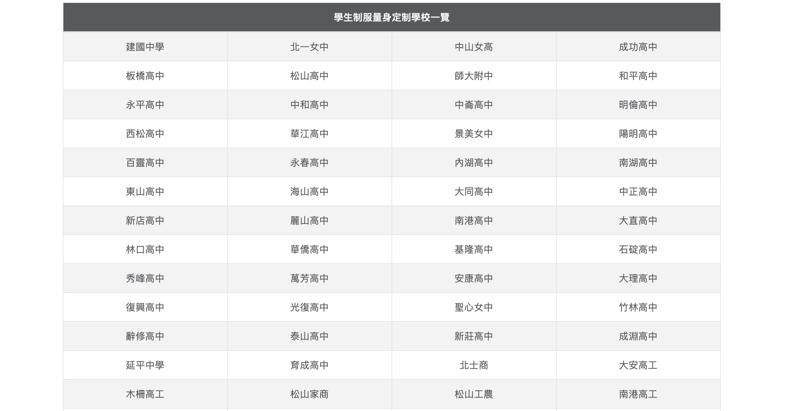

## HiPai-Collection

Hipai-Collection is a showpage website using [bootstrap](https://getbootstrap.com) and [node.JS](https://nodejs.org/en/)/[express](https://github.com/expressjs/express) in the backend.

If you're new to front-end development, its really nice for you to improve your bootstrap skills.

  

## Features

* [Bootstrap Jombotron](https://getbootstrap.com/docs/4.1/components/jumbotron/)

* [Bootstrap Navbar and Navs](https://getbootstrap.com/docs/4.1/components/navbar/)

* Backend : express
  

## Deploy Environment

  * [Heroku](https://www.heroku.com)

  
## Display

## Issues
Feel free to report the issue :0

